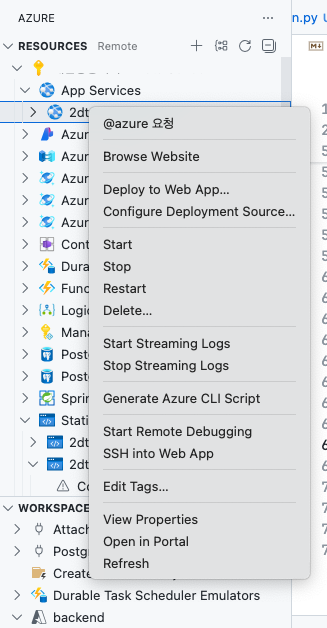

# FastAPI on Azure Web App (App Service)

[Azure Web App](https://learn.microsoft.com/ko-kr/azure/app-service/overview) 서비스에 FastAPI를 구축합니다.

Azure Web App은 Java, .NET, Python 등의 서버를 구축하기 용이한 PaaS입니다.

Azure Web App 명령어에 대한 자세한 아규먼트 내용은 [링크](https://learn.microsoft.com/en-us/cli/azure/webapp?view=azure-cli-latest#az-webapp-up)를 참조하세요.

## 빠른 시작

### 서비스 생성

#### 개요

`Marketplace` ➢ `Azure Web App` ➢ `Create` ➢ 자신의 리소스 그룹

```plaintext
런타임 환경: Python 3.12
서버 환경: Linux
지역(리전): East US 2
(Demo) 스펙: B1 - 1vCPU, RAM 1.75GB, Storage 10GB
(Demo) 요금: 12.41 USD/Month
```

#### Using CLI

##### 리소스 그룹과 서비스 플랜 생성

```sh
# .env로 환경변수를 로드
# cd ./src
export $(grep -v '^#' .env | xargs)
```

```sh
az group create \
  --name $RESOURCE_GROUP_NAME \
  --location $LOCATION
```

```sh
# 서비스 플랜 생성
az appservice plan create \
  --name $PLAN_NAME \
  --resource-group $RESOURCE_GROUP_NAME \
  --sku $SKU \
  --is-linux
```

##### 즉시 배포

###### Deploy.sh

Azure 리소스 그룹과 서비스 플랜을 생성하였다면, 다음 `deploy.sh`를 실행합니다.

알 수 없는 오류가 발생한다면, `VScode Extension`을 통해 업데이트해야 합니다.

```sh
source deploy.sh
```

###### VSCODE 확장으로 배포

기존 리소스와 인스턴스가 없을 경우 생성하고, 존재할 경우 코드를 배포합니다.

`Azure Resource` -> `App Services` 탭 -> 자신의 App Service 우클릭 -> `Deploy to Web App...`으로 프로젝트 폴더 선택 후 배포 진행.



### 시작 스크립트 구성

시작 스크립트 구성은 다음 링크를 참조할 수 있습니다. [Azure App Service QuickStart: Python](https://learn.microsoft.com/ko-kr/azure/app-service/quickstart-python?tabs=fastapi%2Cwindows%2Cazure-portal%2Cazure-cli-deploy%2Cdeploy-instructions-azportal%2Cterminal-bash%2Cdeploy-instructions-zip-azcli)

```sh
# cd ./src
export $(grep -v '^#' .env | xargs)
```

```sh
# 필요한 경우,
# Web App의 시작 지시문(Entrypoint)를 설정
az webapp config set \
    --startup-file "gunicorn -w 2 -k uvicorn.workers.UvicornWorker -b 0.0.0.0:8000 main:app" \
    --name $APP_SERVICE_NAME \
    --resource-group $RESOURCE_GROUP_NAME
```

```sh
# 앱 재시작
az webapp restart \
    --name $APP_SERVICE_NAME \
    --resource-group $RESOURCE_GROUP_NAME
```

### Deployment

`./backend` 폴더를 그대로 Web App에 Deploy 합니다.

[Azure Web App Service 시작](https://learn.microsoft.com/ko-kr/azure/app-service/getting-started?pivots=stack-python)

## 개발 구축

```sh
# Web App을 위한 기본 템플릿은 Azure 공식 Git에서 다운로드 할 수 있습니다.
git clone https://github.com/Azure-Samples/msdocs-python-fastapi-webapp-quickstart.git
```

**가상 환경:**

```sh
# conda create -n test python=3.12

python -m venv .venv
source .venv/bin/activate
# Windows: .\.venv\Scripts\Activate

# 패키지 설치
pip install .

```

**테스트 시작:**

```sh
cd ./src
uvicorn main:app --reload
```
